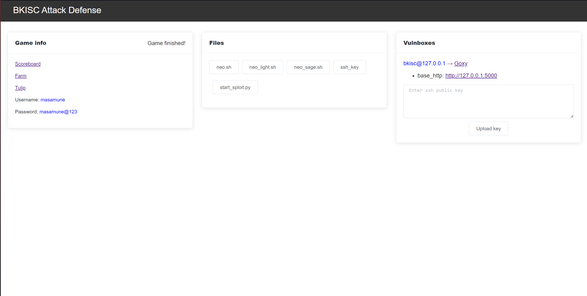
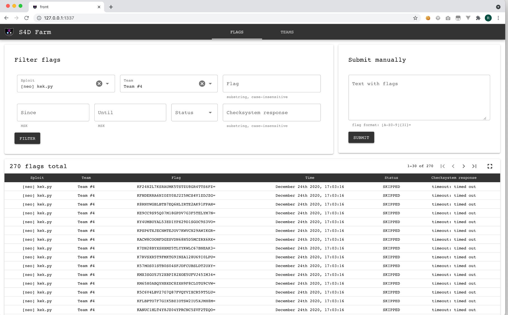
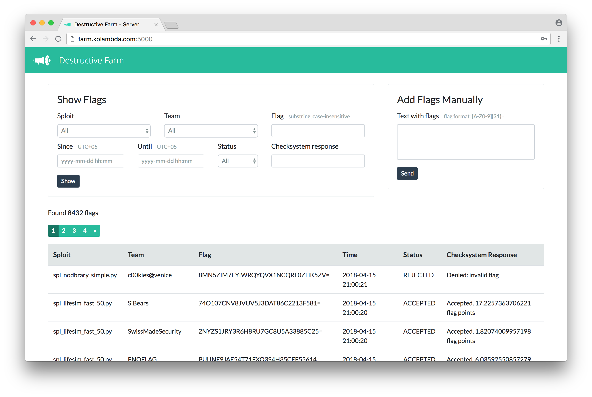
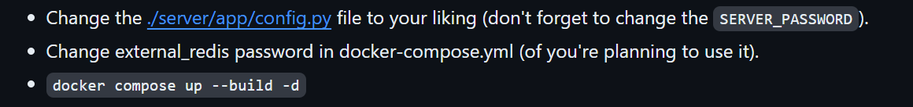
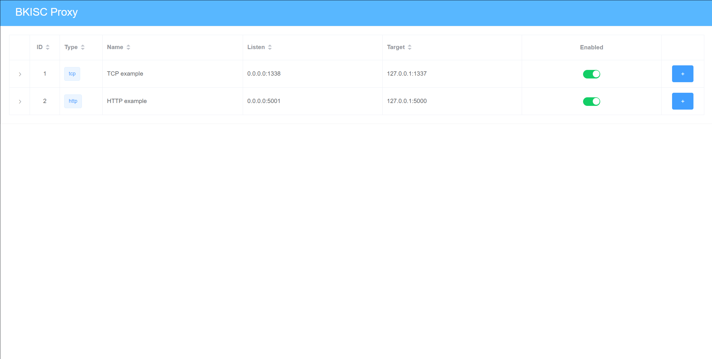
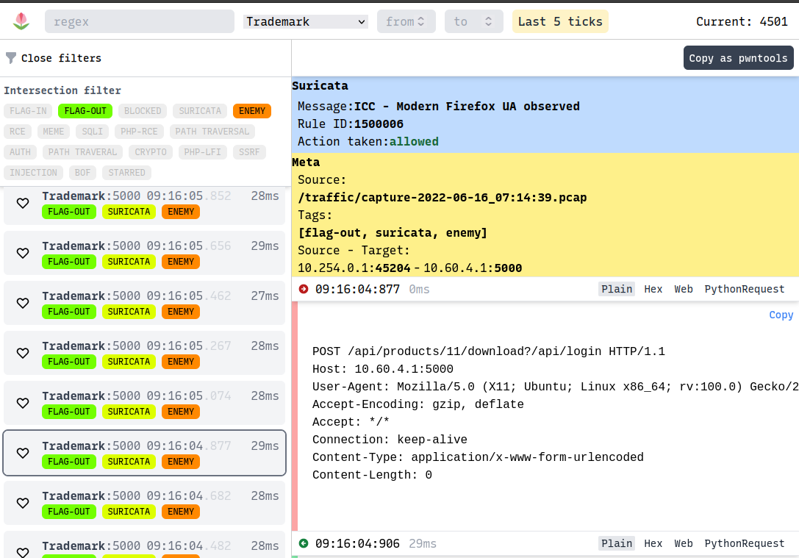

# Attack & Defense CTF Cheatsheet

## Dashboard

### Usage
- Change the config as needed
```python
auth: # Change as needed
  username: admin
  password: admin

game: # Change with the competition you join
  board: "http://127.0.0.1:8000" # This is the Scoreboard of competition
  end: "2020-12-24 14:00:00+03:00" 

vulnboxes: # Change with your vulnbox ip and services 
  - user: bkisc 
    host: 127.0.0.1
    goxy_port: 8000
    services:
      - name: tcp_example
        port: 1338
        proto: tcp
      - name: http_example
        port: 5001
        proto: http
farm: #Your farm 
  addr: 127.0.0.1:5137

tulip: #Your tulip
  addr: 127.0.0.1:3000

neo: #Not fix yeet
  addr: 127.0.0.1:5005
  version: '2.0'

```
- Config path `/resources` as needed (Ex: ssh_key, sample script to exploit)
- run `./dash` and go to http://127.0.0.1:8000


## Attack tool
S4DFram: https://github.com/C4T-BuT-S4D/S4DFarm (Team recommend)

DestructiveFarm: https://github.com/DestructiveVoice/DestructiveFarm (Solo recommend)

### Usage
Setup (S4DFram):


About file config.py:
```python
import os

# import validators.volgactf

CONFIG = {
    'DEBUG': os.getenv('DEBUG') == '1',

    'TEAMS': {
        f'Team #{i}': f'10.60.{i}.3'
        for i in range(0, 10)
    },
    # 'FLAG_FORMAT': r'CTF\.Moscow\{[a-zA-Z\.0-9_-]+\}',
    # 'FLAG_FORMAT': r'VolgaCTF{[\w-]*\.[\w-]*\.[\w-]*}',
    'FLAG_FORMAT': r'[A-Z0-9]{31}=',

    # 'SYSTEM_PROTOCOL': 'ructf_http',
    # 'SYSTEM_URL': 'http://monitor.ructfe.org/flags',
    # 'SYSTEM_TOKEN': '275_17fc104dd58d429ec11b4a5e82041cd2',

    'SYSTEM_PROTOCOL': 'forcad_tcp',
    'SYSTEM_HOST': '10.10.10.10',
    'SYSTEM_PORT': '31337',
    'TEAM_TOKEN': '4fdcd6e54faa8991',
    # 'SYSTEM_PROTOCOL': 'volgactf',
    # 'SYSTEM_VALIDATOR': 'volgactf',
    # 'SYSTEM_HOST': 'final.volgactf.ru',
    # 'SYSTEM_SERVER_KEY': validators.volgactf.get_public_key('https://final.volgactf.ru'),

    # The server will submit not more than SUBMIT_FLAG_LIMIT flags
    # every SUBMIT_PERIOD seconds. Flags received more than
    # FLAG_LIFETIME seconds ago will be skipped.
    'SUBMIT_FLAG_LIMIT': 100,
    'SUBMIT_PERIOD': 2,
    'FLAG_LIFETIME': 5 * 60,

    # VOLGA: Don't make more than INFO_FLAG_LIMIT requests to get flag info,
    # usually should be more than SUBMIT_FLAG_LIMIT
    # 'INFO_FLAG_LIMIT': 10,

    # Password for the web interface. This key will be excluded from config
    # before sending it to farm clients.
    # ########## DO NOT FORGET TO CHANGE IT ##########
    'SERVER_PASSWORD': os.getenv('SERVER_PASSWORD') or '1234',

    # For all time-related operations
    'TIMEZONE': 'Europe/Moscow',
}
```
+ Team config: Config the team ip that your opponent is. 
Ex: 10.60.0.3 (Team 1), 10.60.1.3 (Team 2).
```python
'TEAMS': {
    f'Team #{i}': f'10.60.{i}.3'
    for i in range(0, 10)
}
```
+ Flag config: This will base on the rule of the competition you join.
`'FLAG_FORMAT': r'[A-Z0-9]{31}='`
or
`'FLAG_FORMAT': r'BKISC{[\w-]*\.[\w-]*\.[\w-]*}'`
+ System config: This will base on the competition you join like FAUST CTF, RuCTF.
Example:
RuCTF config:
```python
'SYSTEM_PROTOCOL': 'ructf_http',
'SYSTEM_URL': 'http://monitor.ructfe.org/flags',
'SYSTEM_TOKEN': 'your_secret_token',
```
+ FLAG_LIFETIME: Base on the competition. 
+ SERVER_PASSWORD: You need to change this.
**Note:** If you cannot configure your farm, there are some useful templates available in `/dashboard/resources` for submitting flags or automating attacks.

### Submit flag
command: `python3 start_sploit.py --server-url http://FARM-IP/ --server-pass YOUR_PASS exploit.py`
Sample_exploit.py
```python
#!/usr/bin/env python3

import random
import string
import sys

print("Hello! I am a little sploit. I could be written on any language, but "
      "my author loves Python. Look at my source - it is really simple. "
      "I should steal flags and print them on stdout or stderr. ")

host = sys.argv[1]
print("I need to attack a team with host: {}".format(host))

print("Here are some random flags for you:")

for _ in range(3):
    flag = ''.join(random.choice(string.ascii_uppercase + string.digits) for _ in range(31)) + '='
    print(flag, flush=True)
```
**Note:** Two important things that should be in your exploit script are `#!/usr/bin/env python3` and `print(flag, flush=True)`.
## Defense tool
**Note:** The defense tool must install in your vulnbox! 
- Proxy (Beta): 

### Usage
```yaml
// Change your rules here
rules:
    ####### TCP RULES ########
    - name: flag_in_tcp
      type: tcp::ingress::regex
      args:
          - "[A-Z0-9]{31}="
    - name: flag_out_tcp
      type: tcp::egress::regex
      args:
          - "[A-Z0-9]{31}="
    ######## END HTTP RULES #########
    - name: flag_in_http
      type: http::ingress::body::regex
      args:
          - "[A-Z0-9]{31}="
    - name: flag_out_http
      type: http::egress::body::regex
      args:
          - "[A-Z0-9]{31}="
// Change your services here
services:
    - name: TCP example
      type: tcp
      listen: 0.0.0.0:1338
      target: 127.0.0.1:1337
      filters:
        - rule: flag_in_tcp
          verdict: "alert:: flag in tcp"
        - rule: flag_out_tcp
          verdict: "alert:: flag out tcp"

    - name: HTTP example
      type: http
      listen: 0.0.0.0:5001
      target: 127.0.0.1:5000
      request_timeout: 10s
      filters:
        - rule: flag_in_http
          verdict: "alert:: flag in http"
        - rule: flag_out_http
          verdict: "alert:: flag out http"

web: // Change as needed
    username: admin
    password: admin
```
- `./proxy` and then go to http://127.0.0.1:8000
**Note:** You can add rule in frontend. 
#### ***Update details of this tool later***
- ctf_proxy (beta): An Intrusion Prevention System 
Update usage of this tool later.
Details: https://github.com/ByteLeMani/ctf_proxy
- Iptables (alternative): 
If you don't know what is Iptables, follow this [slide](https://docs.google.com/presentation/d/1JEaOmak3C0HvF9fNzwa_oPXHPaylreRCH-fe0OBNGbM/edit?usp=sharing). 
```bash
iptables-save > /tmp/dump.txt 
iptables -F
iptables-restore < /tmp/dump.txt
iptables -nvL -t filter
iptables -A FORWARD -p tcp –dport 80 -j ACCEPT
iptables -I FORWARD 1 -t filter -p tcp \ 
-d [vulnbox_ip] –dport [service_port] \
-m string –string “[payload]” –algo bm \
[-m string –hex-string “| [hex] |” –algo kmp \]
-j DROP
```
Details: 
`iptables-save > /tmp/dump.txt` saves the current iptables configuration to file dump.txt
`iptables -F` deletes all rules, this is reset operation.
`iptables-restore < /tmp/dump.txt` restores the iptables configuration.
`iptables -nvL -t filter` lists the current rules in the filter table (Can use for debug)
`iptables -A FORWARD -p tcp --dport 80 -j ACCEPT` allows TCP traffic on port 80
```bash
iptables -I FORWARD 1 -t filter -p tcp \
-d [vulnbox_ip] --dport [service_port] \
-m string --string “[payload]” --algo bm \
[-m string --hex-string “| [hex] |” --algo kmp \]
-j DROP
```
This rule inserts into the FORWARD chain, and you can modify it according to your needs. The hex string filter is optional. The -j DROP action will drop any packet that matches the rule, effectively blocking it.
Example: 
- `-m string --string “malicious string” --algo bm`
- `[-m string --hex-string “| 6576696C5F7061796C6F6164 |” --algo kmp \]` evil_payload

Other alternative iptables:
```bash
iptables -I INPUT 1 -p tcp --dport 80 -m string --hex-string '| hex will be block here |' --algo bm -j DROP
iptables -I FORWARD 1 -p tcp --dport 80 -m string --hex-string '| hex will be block here |' --algo bm -j DROP
iptables -A OUTPUT -p tcp -m string --string "PAYLOAD" --algo bm -j DROP
```

**Note:** In case you write a rule incorrectly, such as using `-string "*"`, be aware that the `*` character can match any packets, which might include critical protocols like SSH. This could result in SSH connections being dropped. Therefore, be careful when writing iptables rules. If you do write an incorrect rule, delete it immediately and restore the previous configuration.
## Log tool
- Tulip: https://github.com/OpenAttackDefenseTools/tulip


Setup tulip:

- Edit `/services/api/configurations.py`
```python
#!/usr/bin/env python
# -*- coding: utf-8 -*-

import os
from pathlib import Path

traffic_dir = Path(os.getenv("TULIP_TRAFFIC_DIR", "/traffic"))
tick_length = os.getenv("TICK_LENGTH", 2*60*1000)
start_date = os.getenv("TICK_START", "2018-06-27T13:00+02:00")
mongo_host = os.getenv("TULIP_MONGO", "localhost:27017")
flag_regex = os.getenv("FLAG_REGEX", "[A-Z0-9]{31}=")
mongo_server = f'mongodb://{mongo_host}/'
vm_ip = os.getenv("VM_IP", "10.10.3.1")

services = [{"ip": vm_ip, "port": 9876, "name": "cc_market"},
            {"ip": vm_ip, "port": 80, "name": "maze"},
            {"ip": vm_ip, "port": 8080, "name": "scadent"},
            {"ip": vm_ip, "port": 5000, "name": "starchaser"},
            {"ip": vm_ip, "port": 1883, "name": "scadnet_bin"},
            {"ip": vm_ip, "port": -1, "name": "other"}]
```

- Command: `cp .env.example .env` 
This will copy file .env and then edit as you want. If you dont know how to config just focus `FLAG_REGEX="[A-Z0-9]{31}="` and `TRAFFIC_DIR_HOST="./services/test_pcap"`
- `docker-compose up -d --build` 

**Note:** You need to use tcpdump to capture the traffic and then save the `.pcap` file in the `test_pcap` folder so that Tulip can receive and analyze it.

**pcap-broker:** A tool to capture network traffic and make this available to one or more clients via [PCAP-over-IP](https://www.netresec.com/?page=Blog&month=2022-08&post=What-is-PCAP-over-IP).

### Usage

To build `pcap-broker`
```bash
go build ./cmd/pcap-broker
./pcap-broker --help
```
 Or you can build with docker
```bash
docker build -t pcap-broker .
docker run -it pcap-broker --help
```
And then you can run like this:
```bash
./pcap-broker --help
Usage of ./pcap-broker:
  -cmd string
        command to execute for pcap data (eg: tcpdump -i eth0 -n --immediate-mode -s 65535 -U -w -)
  -debug
        enable debug logging
  -json
        enable json logging
  -listen string
        listen address for pcap-over-ip (eg: localhost:4242)
  -n    disable reverse lookup of connecting PCAP-over-IP client IP address
```
Arguments can be passed via commandline:
```bash
./pcap-broker -cmd "sudo tcpdump -i eth0 -n --immediate-mode -s 65535 -U -w -"
```
Or alternatively via environment variables:
```bash
LISTEN_ADDRESS=:4242 PCAP_COMMAND='sudo tcpdump -i eth0 -n --immediate-mode -s 65535 -U -w -' ./pcap-broker
```
**Note:** Using environment variables is useful when you are using `pcap-broker` in a Docker setup.
Now you can connect to it via TCP and stream PCAP data using `nc` and `tcpdump`:
`nc -v localhost 4242 | tcpdump -nr -`
Or use a tool that natively supports PCAP-over-IP, for example `tshark`:
`tshark -i TCP@localhost:4242`
More details: https://github.com/fox-it/pcap-broker
**TCPDump (alternative):** Use to dump traffic on a network
Command: `tcpdump -i any -w -not port 22 -w /tmp/capture-%Y-%m-%d-%H-%M-%S.pcap`

## Some useful command
- `scp -i ~/.ssh/yourkey -r ./proxy masamune@IP:/tmp/source` Copy resource from your local to your vulnbox.
- `passwd` Change your password.
- `ssh-keygen -t ed25519` Generating an ssh public key and private key pair.


